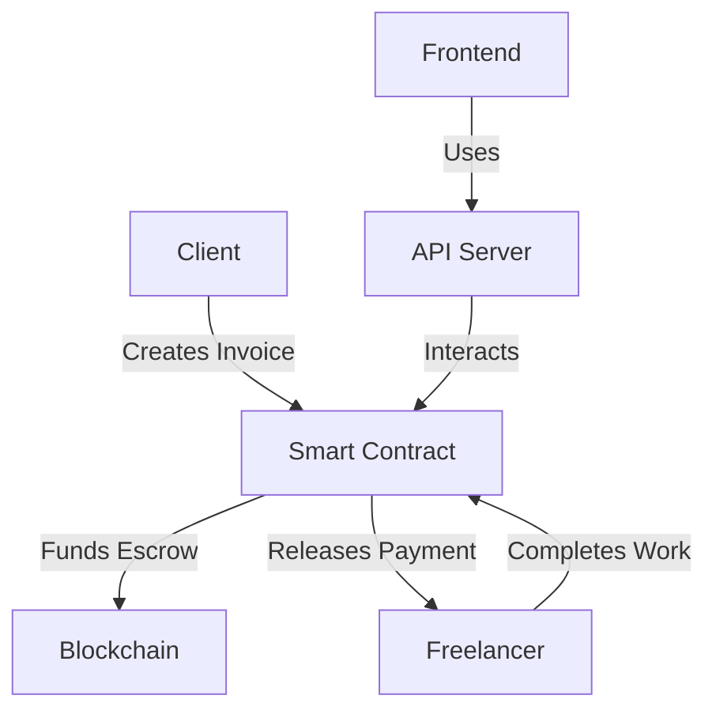

<div align="center">

# 💼 Freelance Escrow Smart Contract
## 🔗 **Blockchain** Solution


**A decentralized invoice and payment escrow system built on Ethereum Blockchain, designed for freelancers and clients to securely manage payments through smart contracts.**

[Features](#-features) • [Installation](#-installation) • [Usage](#-usage) • [Documentation](#-documentation)

---

</div>

## 🌟 Overview

This project is a comprehensive **Blockchain-based** escrow system that revolutionizes how freelancers and clients handle payments. Built on the **Ethereum Blockchain**, it provides a trustless, transparent, and secure way to manage invoices and payments without intermediaries.

### 🎯 Why Blockchain?

- ✅ **Decentralized**: No single point of failure
- ✅ **Transparent**: All transactions are verifiable on-chain
- ✅ **Secure**: Smart contracts ensure funds are held safely
- ✅ **Trustless**: No need for third-party intermediaries
- ✅ **Immutable**: Once deployed, contract logic cannot be changed

---

## 🏗️ Project Architecture

<div align="center">



</div>

### 📦 Project Structure

```
freelance-escrow-smart-contract/
│
├── 🔷 hardhat/                    # Smart Contract Development
│   ├── contracts/                 # Solidity smart contracts
│   │   └── InvoiceEscrow.sol     # Main escrow contract
│   ├── scripts/                   # Deployment scripts
│   ├── test/                      # Contract tests
│   └── ignition/                  # Hardhat Ignition modules
│
└── 🟢 api/                        # REST API Server
    ├── src/
    │   ├── routes/                # API endpoints
    │   ├── services/              # Business logic
    │   └── config/                # Configuration
    └── scripts/                   # Utility scripts
```

---

## ✨ Features

<table>
<tr>
<td width="50%">

### 🔐 Security Features
- ✅ OpenZeppelin audited contracts
- ✅ Access control mechanisms
- ✅ Reentrancy protection
- ✅ Secure escrow handling

</td>
<td width="50%">

### 💰 Payment Features
- ✅ Multi-invoice management
- ✅ Automatic payment release
- ✅ Refund capabilities
- ✅ Status tracking

</td>
</tr>
<tr>
<td width="50%">

### 📊 Invoice Management
- ✅ Create invoices
- ✅ Track invoice status
- ✅ View invoice history
- ✅ Cancel invoices

</td>
<td width="50%">

### 🔗 Blockchain Integration
- ✅ Ethereum network support
- ✅ Sepolia testnet ready
- ✅ Ethers.js integration
- ✅ Real-time transaction tracking

</td>
</tr>
</table>

### 📈 Invoice Lifecycle

```
┌─────────┐     ┌─────────┐     ┌──────────┐     ┌────────┐
│ CREATED │ --> │ FUNDED  │ --> │ COMPLETED│ --> │  PAID  │
└─────────┘     └─────────┘     └──────────┘     └────────┘
     │                                                │
     └────────────────────────────────────────────────┘
                    │
                    ▼
              ┌──────────┐
              │CANCELLED │
              └──────────┘
```

---

## 🚀 Quick Start

### Prerequisites

| Requirement | Version | Description |
|------------|---------|-------------|
| **Node.js** | ≥ 18.0 | JavaScript runtime |
| **npm** | Latest | Package manager |
| **MetaMask** | Latest | Ethereum wallet |
| **Sepolia ETH** | - | Testnet tokens |

> 💡 Get Sepolia ETH from [Sepolia Faucet](https://sepoliafaucet.com/)

### Installation

#### 1️⃣ Clone the Repository

```bash
git clone <repository-url>
cd freelance-escrow-smart-contract
```

#### 2️⃣ Install Smart Contract Dependencies

```bash
cd hardhat
npm install
```

#### 3️⃣ Install API Dependencies

```bash
cd ../api
npm install
```

---

## ⚙️ Configuration

### 🔷 Hardhat Configuration

Create a `.env` file in the `hardhat/` directory:

```env
# Blockchain Network Configuration
PRIVATE_KEY=your_private_key_here
SEPOLIA_RPC_URL=https://sepolia.infura.io/v3/your_key
ETHERSCAN_API_KEY=your_etherscan_api_key

# Network: Sepolia Testnet
```

### 🟢 API Configuration

Create a `.env` file in the `api/` directory:

```env
# Blockchain Connection
PRIVATE_KEY=your_private_key_here
RPC_URL=https://sepolia.infura.io/v3/your_key
CONTRACT_ADDRESS=0x...your_deployed_contract_address

# Server Configuration
PORT=3000
NODE_ENV=development
```

> ⚠️ **Security Note**: Never commit `.env` files to version control!

---

## 💻 Usage

### 🔨 Compile Smart Contracts

```bash
cd hardhat
npm run compile
```

**Output:**
```
Compiling 1 file with 0.8.28
Compilation finished successfully
```

### 🚀 Deploy to Blockchain

```bash
cd hardhat
npm run deploy
```

**Before deploying, ensure:**
- ✅ `.env` file is configured
- ✅ Wallet has sufficient Sepolia ETH
- ✅ Network connection is stable

### 🌐 Start API Server

```bash
cd api
npm run dev
```

**Server will start at:** `http://localhost:3000`

---

## 📚 API Documentation

### Available Endpoints

| Method | Endpoint | Description |
|--------|----------|-------------|
| `POST` | `/api/invoices` | Create a new invoice |
| `GET` | `/api/invoices/:id` | Get invoice details |
| `GET` | `/api/invoices` | List all invoices |
| `POST` | `/api/invoices/:id/fund` | Fund an invoice |
| `POST` | `/api/invoices/:id/complete` | Mark invoice as complete |
| `POST` | `/api/invoices/:id/release` | Release payment |
| `POST` | `/api/invoices/:id/cancel` | Cancel an invoice |

### 📖 Documentation Files

- 📄 [`api/README.md`](api/README.md) - Complete API documentation
- 📄 [`api/ADDRESS_GUIDE.md`](api/ADDRESS_GUIDE.md) - Contract address management
- 📄 [`api/WALLET_GUIDE.md`](api/WALLET_GUIDE.md) - Wallet setup guide
- 📄 [`api/InvoiceEscrow_API.postman_collection.json`](api/InvoiceEscrow_API.postman_collection.json) - Postman collection

---

## 🔷 Smart Contract Details

### InvoiceEscrow Contract

The core smart contract that manages the entire escrow process on the **Blockchain**.

#### Key Functions

| Function | Description | Access |
|----------|-------------|--------|
| `createInvoice()` | Create a new invoice | Public |
| `fundInvoice()` | Deposit payment to escrow | Public |
| `markComplete()` | Mark work as completed | Freelancer |
| `releasePayment()` | Release payment to freelancer | Client |
| `cancelInvoice()` | Cancel an invoice | Client/Freelancer |

#### Invoice Status Flow

```solidity
CREATED → FUNDED → COMPLETED → PAID
   ↓                              ↑
   └──────── CANCELLED ──────────┘
```

#### Contract Features

- 🔒 **Ownable**: Contract owner can manage settings
- 💰 **Escrow**: Funds held securely until conditions met
- 📊 **Events**: All actions emit blockchain events
- 🛡️ **Security**: ReentrancyGuard and access controls

---

## 🧪 Development

### Running Tests

```bash
cd hardhat
npx hardhat test
```

### Type Checking

```bash
cd api
npm run type-check
```

### Building for Production

```bash
cd api
npm run build
npm start
```

---

## 🔒 Security

<div align="center">

| Security Feature | Status | Description |
|-----------------|--------|-------------|
| **OpenZeppelin** | ✅ | Battle-tested contracts |
| **ReentrancyGuard** | ✅ | Prevents reentrancy attacks |
| **Access Control** | ✅ | Role-based permissions |
| **Code Audits** | ✅ | Best practices followed |

</div>

### Security Best Practices

- ✅ Uses OpenZeppelin's audited contracts
- ✅ Implements reentrancy protection
- ✅ Comprehensive access control
- ✅ Secure escrow mechanism
- ✅ Input validation
- ✅ Safe math operations

---

## 📊 Technology Stack

<div align="center">

### **Blockchain Layer**


### **Backend Layer**


### **Blockchain Network**


</div>

---

## 🤝 Contributing

We welcome contributions! Please follow these steps:

1. 🍴 Fork the repository
2. 🌿 Create a feature branch (`git checkout -b feature/AmazingFeature`)
3. 💾 Commit your changes (`git commit -m 'Add some AmazingFeature'`)
4. 📤 Push to the branch (`git push origin feature/AmazingFeature`)
5. 🔄 Open a Pull Request

---

## 📄 License

This project is licensed under the **MIT License** - see the LICENSE file for details.

---

## 🆘 Support

<div align="center">

### Need Help?

- 📧 Open an issue on GitHub
- 📖 Check the documentation
- 💬 Contact the development team

**Built with ❤️ using Blockchain Technology**

---

<div align="center">

**⭐ Star this repo if you find it helpful!**

[⬆ Back to Top](#-freelance-escrow-smart-contract)

</div>
